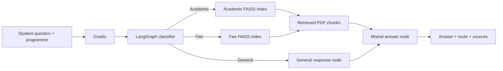

# College AI Assistant - RAG + LangGraph

A beginner-friendly showcase project for third- and fourth-year college students. The app answers questions about academics, fees, examinations, attendance, and course requirements by routing each query through a visible LangGraph workflow.

> Important: the included Northstar College PDFs and all dates, amounts, contacts, and policies are fictional classroom data. Replace them with approved institutional documents before any real deployment.

## What students learn

- How Retrieval-Augmented Generation (RAG) reduces unsupported answers
- How embeddings and FAISS enable semantic document search
- How LangGraph state, nodes, edges, and conditional routing work
- How Mistral turns retrieved context into a readable answer
- How a programme selector can personalize a response
- How Gradio turns Python functions into a simple chatbot interface

## Workflow



## Project structure

```text
college-ai-assistant-starter/
|-- app.py                     # Gradio interface
|-- build_indexes.py           # Creates the FAISS indexes
|-- smoke_test.py              # Quick checks that need no API call
|-- requirements.txt
|-- .env.example
|-- assets/
|   `-- architecture.png
|-- data/
|   |-- source_pdfs/
|   |   |-- northstar_academic_guide.pdf
|   |   `-- northstar_fee_guide.pdf
|   `-- faiss_indexes/         # Generated locally
|-- src/
|   |-- classifier.py
|   |-- rag.py
|   |-- settings.py
|   `-- workflow.py
`-- tests/
    `-- test_classifier.py
```

## Quick start

Use Python 3.11. From this folder:

### 1. Create and activate a virtual environment

Windows PowerShell:

```powershell
py -3.11 -m venv .venv
.\.venv\Scripts\Activate.ps1
```

macOS or Linux:

```bash
python3.11 -m venv .venv
source .venv/bin/activate
```

### 2. Install packages

```bash
python -m pip install --upgrade pip
python -m pip install -r requirements.txt
```

### 3. Add the Mistral key

Copy `.env.example` to `.env`, then replace the placeholder value. Do not commit `.env` or share the key in screenshots.

### 4. Build the FAISS indexes

```bash
python build_indexes.py
```

The first run downloads the small Hugging Face embedding model. The Mistral key is not used while indexes are built.

### 5. Run the checks

```bash
python smoke_test.py
python -m unittest discover -s tests -v
```

### 6. Start the chatbot

```bash
python app.py
```

Open the local URL printed in the terminal, usually `http://127.0.0.1:7860`.

## Questions to try

- B.Tech CSE: `What is the minimum attendance required to write the end-semester exam?`
- B.Sc Data Science: `How many credits are required for the degree?`
- BBA: `What is my semester tuition and when is it due?`
- Any programme: `What happens if I pay the fee late?`
- Any programme: `Explain what a prerequisite course means.`

The response shows the selected route and retrieved PDF pages. Exact account balances, marks, and attendance are deliberately unsupported because the demo has no student database.

## Replace the sample data

1. Put approved academic PDFs in `data/source_pdfs` with `academic` in each filename.
2. Put approved fee PDFs in the same folder with `fee` in each filename.
3. Rebuild with `python build_indexes.py --force`.
4. Re-run the evaluation questions in the lab manual.

The project saves the FAISS vectors in `index.faiss` and the matching text/metadata in readable `documents.json`. This avoids loading a serialized Python object and makes the teaching data easy to inspect.

## Official references

- [LangGraph Graph API](https://docs.langchain.com/oss/python/langgraph/graph-api)
- [LangChain vector stores](https://docs.langchain.com/oss/python/integrations/vectorstores/index)
- [LangChain Mistral integration](https://docs.langchain.com/oss/python/integrations/chat/mistralai)
- [Hugging Face sentence-transformer embeddings](https://docs.langchain.com/oss/python/integrations/embeddings/sentence_transformers)
- [Mistral API key quickstart](https://docs.mistral.ai/getting-started/quickstarts/studio/activate-and-generate-api-key)
- [Gradio ChatInterface](https://gradio.app/docs/gradio/chatinterface)
- [FAISS project](https://github.com/facebookresearch/faiss)
